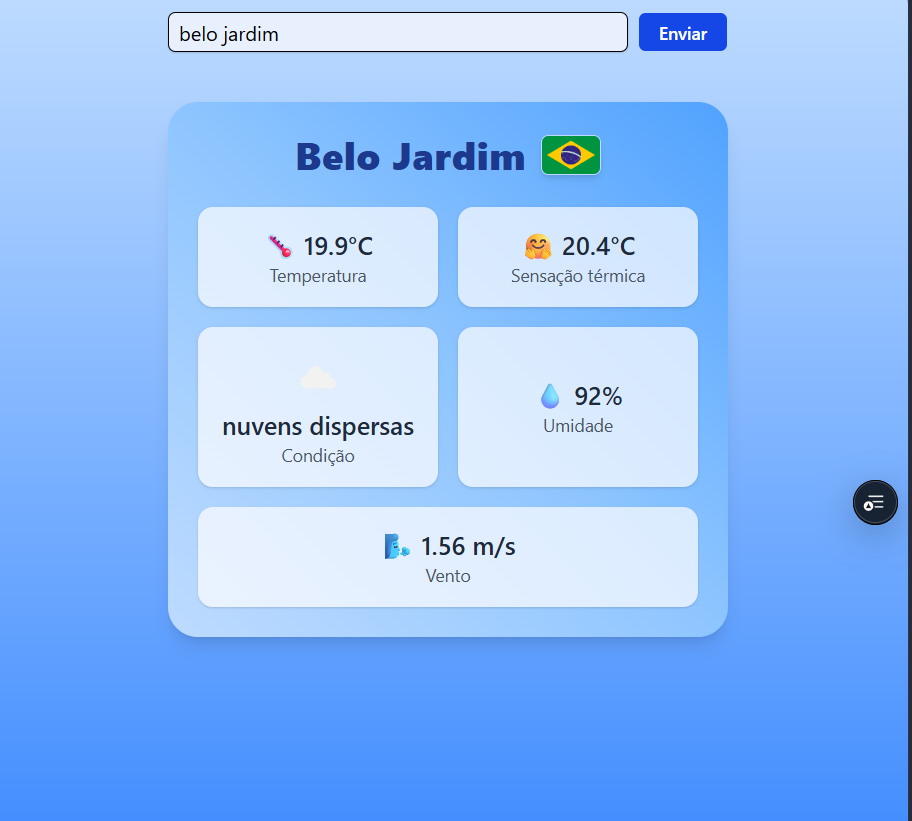

# 🌦️ Weather App com Next.js

Aplicação simples e responsiva de previsão do tempo desenvolvida em **Next.js** utilizando a **API da OpenWeatherMap**.  
O usuário pode pesquisar por uma cidade e visualizar informações como temperatura, sensação térmica, condição climática, umidade e velocidade do vento, além da bandeira do país correspondente.

---

## 🚀 Tecnologias utilizadas

- [Next.js](https://nextjs.org/) — Framework React para aplicações modernas
- [TypeScript](https://www.typescriptlang.org/) — Tipagem estática para maior segurança
- [Tailwind CSS](https://tailwindcss.com/) — Estilização rápida e responsiva
- [OpenWeatherMap API](https://openweathermap.org/api) — Fonte de dados climáticos

---

## ✨ Funcionalidades

- 🔍 Pesquisa dinâmica por cidade
- 🌡️ Exibição de temperatura e sensação térmica
- ☁️ Condição climática atual
- 💧 Umidade relativa do ar
- 🌬️ Velocidade do vento
- 🇧🇷 Bandeira do país correspondente
- 📱 Layout responsivo com Tailwind

---

## visual do projeto

---

## 📄 Licença

Este projeto está sob a licença MIT.  
Sinta-se livre para usar, modificar e compartilhar.

---

## 👨‍💻 Autor

Desenvolvido por **Anthony** 🚀

---

## Acesso

Link: <https://weather-0-1-anthony-albuquerque405-anthonys-projects-e8fb87e2.vercel.app/>
